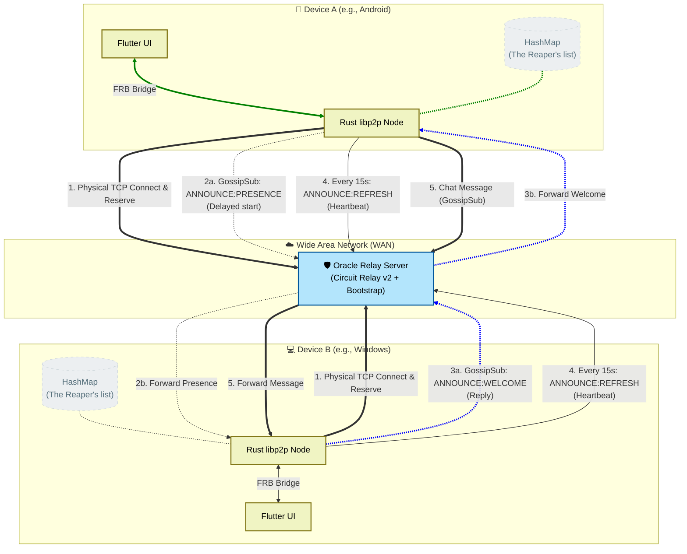

# Distributed P2P Messenger (Advanced Prototype)

A fully distributed, federated messaging application built for privacy, resilience, and high performance. This project creates a private overlay network where users communicate directly (Peer-to-Peer), leveraging **Relay nodes** to bypass NAT and firewalls without compromising decentralization.

> **Portfolio Note:** This project is part of my engineering portfolio, exploring advanced concepts in decentralized systems, cryptography, and memory-safe programming. This project demonstrates knowledge of Rust asynchronous programming, distributed systems architecture (libp2p), and cross-platform Flutter integration. It features a custom-built presence protocol and automated lifecycle management.

## 🚀 Project Overview

The core mission of this project is to provide a communication tool where the user is the owner of the infrastructure. Unlike traditional apps (WhatsApp, Telegram) that rely on centralized servers to route and store messages, this system uses a decentralized mesh topology.

### The WAN Leap (December 2025)

Originally a local-only prototype, the project has evolved into a Wide Area Network (WAN) capable system. By deploying a dedicated Relay Server (Circuit Relay v2) on Oracle Cloud (my case, could be any other publicly available server), nodes behind restrictive home routers or mobile 4G/5G connections can now discover each other and exchange messages globally.



---

## 🏗️ Detailed Engineering Features

### 🆔 Cryptographic Identity

Every user is identified by a unique PeerID, which is cryptographically derived from an `Ed25519` keypair. This ensures that identities cannot be spoofed and provides the foundation for future End-to-End Encryption (E2EE).

### 🌐 NAT Traversal & Relay Service

Most modern devices inhabit private networks (NAT). To enable connectivity:

* **Circuit Relay v2:** Implemented a standalone Relay server that acts as a "meeting point". Nodes "reserve" a slot in the relay, making them reachable via a public multiaddress.
* **DCUTR (Direct Connection Upgrade through Relay):** The system attempts to perform "hole-punching" to establish a direct socket between peers, using the relay only as a coordinator to minimize latency and server load.

### 📡 Robust Presence Protocol (Handshake)

Since there is no central database of "online users", I implemented a custom **Discovery Handshake** over GossipSub:

1. **ANNOUNCE:PRESENCE**: When a node connects, it broadcasts its arrival.
2. **ANNOUNCE:WELCOME**: Existing nodes reply to the newcomer, ensuring a bi-directional discovery where both parties see each other in the UI instantly.
3. **Automatic Retries**: A 500ms delay is implemented during initialization to ensure the networking stack is fully converged before the first broadcast.

### 💀 Resilience: Heartbeat & The Reaper

To maintain a clean UI and handle "dirty" disconnections (like app crashes or signal loss):

* **Heartbeat**: Every 15 seconds, nodes broadcast a `REFRESH` signal.
* **The Reaper**: Nodes maintain a `HashMap<PeerId, Instant>`. If a peer has been silent for more than **45 seconds**, the "Reaper" logic automatically prunes them from the active list and notifies the Flutter UI to remove the user from the screen.

---

## ✅ Implementation Status

* [x] **Architecture:** Refactored into **Rust Workspaces** (`core`, `node`, `relay`) for modularity.
* [x] **WAN Support:** Fully functional communication across different networks via Oracle Cloud.
* [x] **Handshake Protocol:** Bidirectional peer discovery implemented.
* [x] **Lifecycle Management:** Heartbeat mechanism and Zombie Reaping.
* [x] **Cross-Platform:** Binaries successfully compiled and tested for **Windows** and **Android**.
* [x] **Discovery (LAN):** Integrated mDNS for offline local mesh networking.
* [x] **Persistence:** SQLite integration for local message history.
* [ ] **Transport Security:** Integration of Noise Protocol (Planned).
* [ ] **End-to-End Encryption:** Double Ratchet implementation (Planned).
* [ ] **UI and UX improvements:** Keep implementing new functionalities and refining existing ones (Planned).
* [ ] **Linux and iOS support:** Planned, not tested at the moment.

---

## 🛠️ The Tech Stack

| Layer | Technology | Technical Description |
| --- | --- | --- |
| **Logic Core** | **Rust** | High-concurrency, memory-safe engine using the Tokio async runtime. |
| **Networking** | `libp2p` | The modular P2P stack used by IPFS and Ethereum 2.0. |
| **Messaging** | `gossipsub` | Efficient pub/sub protocol for message propagation. |
| **Discovery** | `kademlia-dht` | Distributed Hash Table for global peer routing. |
| **UI Framework** | **Flutter** | Reactive cross-platform interface with Singleton pattern managers. |
| **Bridge** | `flutter_rust_bridge` | High-performance FFI for zero-copy data transfer between Dart and Rust. |
| **Cloud** | **Oracle Cloud** | Host for the persistent Relay/Bootstrap node. |

---

## 📂 Project Structure (Multi-Package Workspace)

The project is organized into a Rust Workspace to allow code reuse between the mobile/desktop client and the standalone relay server.

```text
├── assets/                     # App configuration and static assets
│   ├── config.json             # (Ignored by git) Local production config
│   └── config.example.json     # Template for setup
├── lib/                        # Flutter Application (Dart)
│   ├── logic/                  # BLoC-like managers (NodeManager, DatabaseHelper)
│   ├── main.dart               # UI implementation (Material Design 3)
│   └── src/rust/               # Auto-generated FFI bindings
├── rust/                       # Rust Workspace Root
│   ├── Cargo.toml              # Workspace definition
│   ├── core/                   # [Crate] Shared logic
│   │   ├── src/behaviour.rs    # Combined libp2p behaviours
│   │   ├── src/transport.rs    # Quic/TCP transport & Relay client setup
│   │   └── src/identity.rs     # Ed25519 key management
│   ├── node/                   # [Crate] The P2P Client (Library)
│   │   └── src/node.rs         # The main Swarm event loop & Heartbeat reaper
│   └── relay/                  # [Crate] Standalone Relay Server (Binary)
│       └── src/main.rs         # High-performance Relay/Bootstrap implementation

```

---

## 🚦 Getting Started

### Prerequisites

* **Flutter SDK** (Stable channel).
* **Rust Toolchain** (Nightly not required, but recommended for build optimizations).
* **Android NDK** (If building for Android).
* **A Cloud Instance** (Optional, for hosting the Relay server).

### 1. Networking Setup

To allow WAN communication, you need a public entry point. It can be an instance on a cloud provider or any public server you have.

1. Open port **4001 (TCP/UDP)**.
2. Deploy the relay. It needs all files from /rust except those from /rust/node (you will need to delete the line ' "node", ' from Cargo.toml):

```bash
cd rust/relay
cargo run --release

```

3. Copy the Server Peer ID generated in the terminal.

### 2. Configuration

The client needs to know where to find the "meeting point".

1. Copy `assets/config.example.json` to `assets/config.json`.
2. Update the `relay_address` and `bootstrap_nodes` with your server's public IP and Peer ID:

```json
{
  "relay_address": "/ip4/your_vps_ip/tcp/4001/p2p/your_server_peer_id/p2p-circuit",
  "bootstrap_nodes": [
    "/ip4/your_vps_ip/tcp/4001/p2p/your_server_peer_id"
  ]
}

```

### 3. Build & Run

In the project root:

**First time setup (FFI generation):**

```bash
flutter_rust_bridge_codegen generate

```

**Launch on Desktop:**

```bash
flutter run -d windows

```

**Launch on Android:**

```bash
# Ensure your device is connected and NDK is configured
flutter run

```

---

## 🛠️ Deep Dive: The Heartbeat Reaper Logic

One of the most interesting parts of the system is how it handles the "distributed state" of users without a central registry.

Every node maintains a `HashMap<PeerId, Instant>`.

* **Discovery:** When any `gossipsub` message or `connection` event arrives, the timestamp for that `PeerId` is updated.
* **The Reaping Task:** A background `tokio` interval runs every 15s. It scans the map and calculates `now() - last_seen`.
* **Automatic Pruning:** If the difference exceeds 45s, the node is considered "Zombie" and removed from the UI. This ensures the chat list is always accurate even if peers lose their internet connection abruptly.
